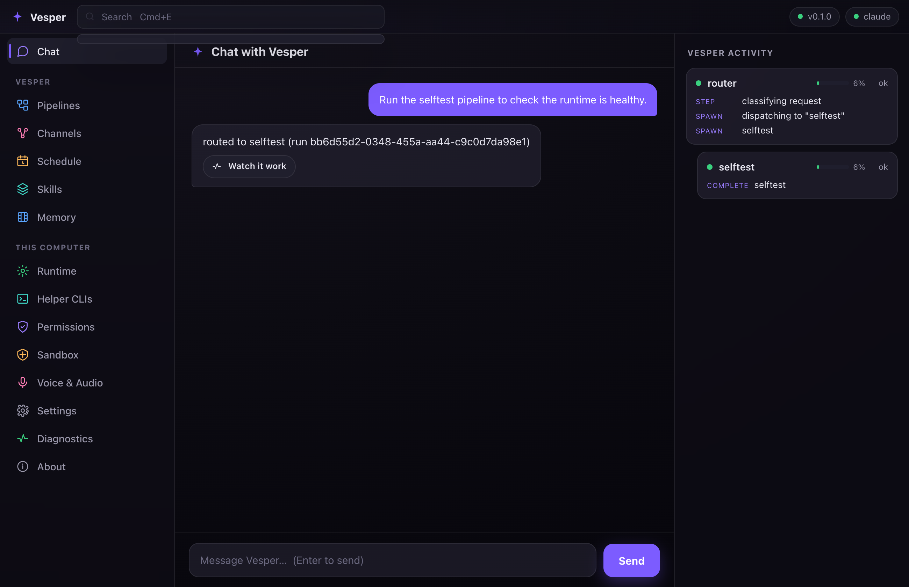
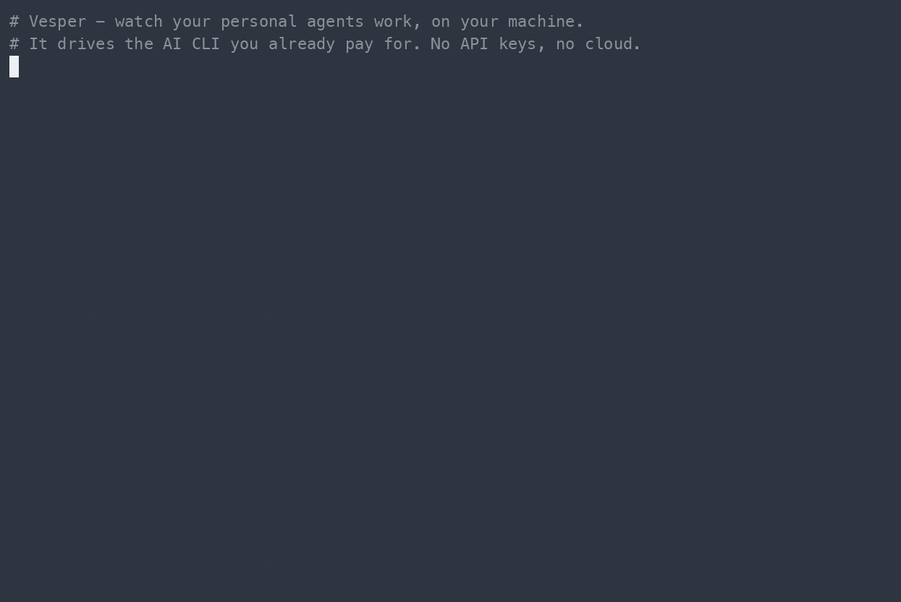
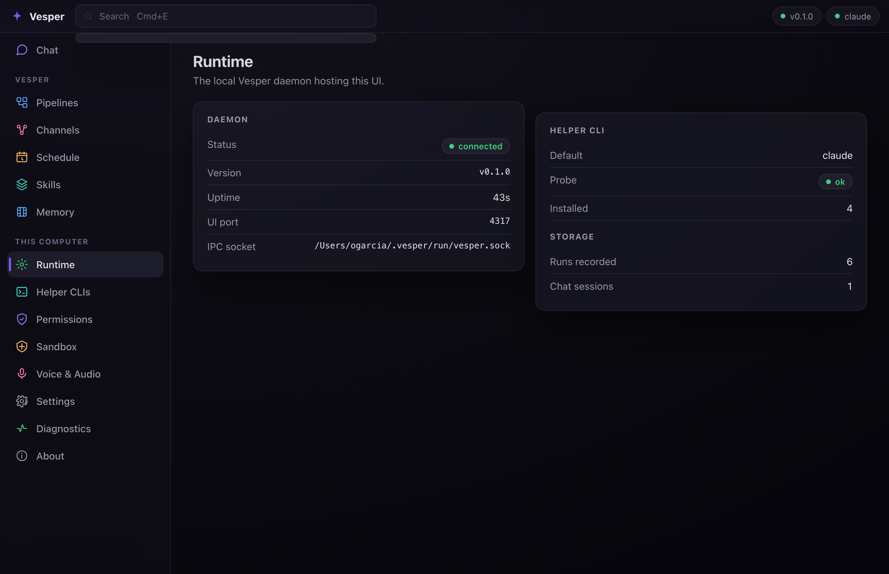
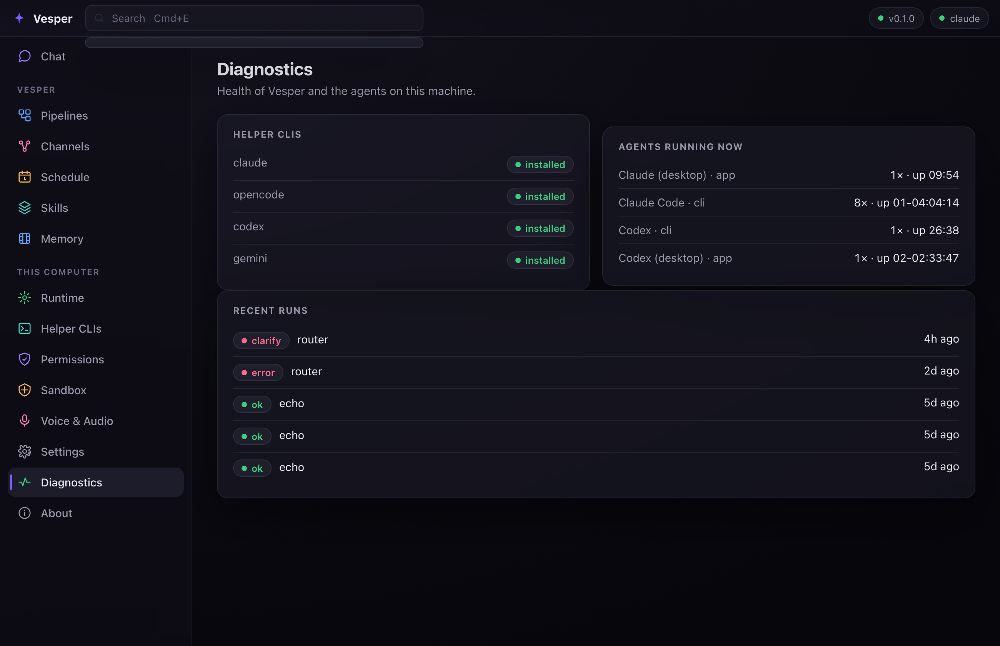
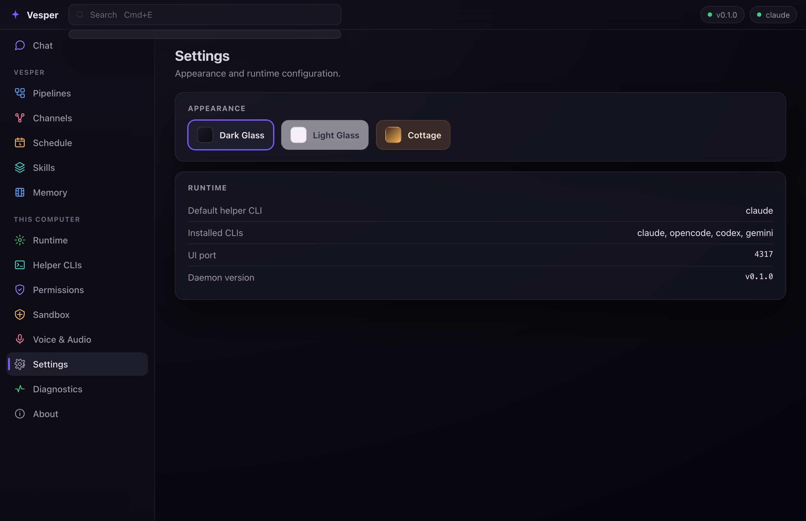

<p align="center">
  
</p>

<h1 align="center">Vesper</h1>

<p align="center">
  <a href="https://github.com/ogarciarevett/vesper/actions/workflows/ci.yml"></a>
  
  
  
  
</p>

<p align="center"><b>A local-first runtime for your personal automation agents — with a native desktop app you actually want to open.</b></p>

Vesper runs on your machine and hosts small automation **pipelines** (your "agents") under one host
process. It drives **the AI CLI you already pay for** — `claude`, `codex`, `opencode`, or `gemini` —
so it holds **no API keys** and ships **no provider SDKs**. Nothing leaves your machine except the
calls your own CLI makes. You talk to it in a premium dark-glass desktop app: chat with Vesper, watch
exactly what it's doing as it works, and manage every pipeline, channel, schedule, and permission from
one window — with a macOS menu-bar popover for a quick glance.

<table>
<tr><td width="34%"><b>Bring your own CLI — no keys</b></td><td>Orchestrates <code>claude</code> / <code>codex</code> / <code>opencode</code> / <code>gemini</code> over a subprocess. You pay once for your CLI; Vesper adds no per-call billing and stores no LLM credentials. Pick the model per request.</td></tr>
<tr><td><b>Chat with Vesper &amp; watch it work</b></td><td>A native dark-glass desktop app: chat with Vesper and it picks the right pipeline, runs it, and streams every step in a live activity rail. A sectioned sidebar manages pipelines, channels, schedules, runtime, permissions, and more — plus a macOS menu-bar popover.</td></tr>
<tr><td><b>Local-first &amp; private</b></td><td>SQLite storage + OS-keychain secrets, all on your machine. The UI binds to <code>127.0.0.1</code> only. No accounts, no cloud, no telemetry.</td></tr>
<tr><td><b>Capability-sandboxed pipelines</b></td><td>Every agent declares what it may touch — invoke a CLI, read/write storage, touch files — and the host enforces it (deny-by-default) before any side effect.</td></tr>
<tr><td><b>Build your own pipelines</b></td><td>A pipeline is a markdown document: edit it as a drag-and-drop flow canvas (wire steps, results pipe along the arrows, an orchestrator model re-authors downstream prompts), as one markdown file in the UI, or as a plain <code>.md</code> in <code>~/.vesper/pipelines/</code>. Permissions are derived from the document and granted in plain language; an "Improve with AI" audit proposes prompt rewrites and per-step model routing from live benchmarks.</td></tr>
<tr><td><b>Self-improving skills</b></td><td>The <code>skill-train</code> engine optimizes a skill's playbook against its own test set (SkillOpt-style: epochs, held-out validation, greedy accept) — using your CLI, never a provider key.</td></tr>
<tr><td><b>A real scheduler</b></td><td>Cron, event, and manual triggers with run-count caps, backoff, and a dead-letter queue. Your agents can run on their own, unattended.</td></tr>
</table>

<p align="center">
  
</p>

---

## The app

```sh
vesper daemon start   # hosts the runtime + the UI (background)
vesper ui             # open it in your browser — http://127.0.0.1:4317
```

Or run the **native desktop app** — a [Tauri](https://tauri.app) shell over the same daemon — from
`packages/vesper-desktop` (`bun run dev`): a frameless window with a macOS menu-bar (tray) popover, no
browser involved.

<p align="center">
  
  
</p>
<p align="center">
  
</p>

Chat with Vesper and it routes your message to the right pipeline and streams the run live in a Vesper
activity rail. Every section reads your **real** runtime — nothing is faked: **Runtime** (daemon +
helper-CLI health), **Diagnostics** (CLI probes, recent runs, and the agents running on your machine),
**Channels**, **Schedule**, **Pipelines**, **Permissions**, **Settings** (theme + config), and more.
Dark glass is the default; a light and a warm theme ship too. See [docs/ui.md](docs/ui.md).

## Bring your own CLI

Vesper does **not** ship or call any LLM provider SDK, and it never holds an API key. It orchestrates
the AI CLI you already have authenticated:

- [`claude`](https://docs.claude.com/en/docs/claude-code) (Claude Code) · `opencode` · `codex` · `gemini`

It shells out to whichever you have installed (via `Bun.spawn`) and composes on top. The only secrets
Vesper keeps are *pipeline-side* (e.g. a GitHub token) in your OS keychain — never LLM auth.

## Requirements

- [Bun](https://bun.sh) ≥ 1.1
- macOS (the vault uses the system Keychain via the `security` CLI)
- At least one installed, authenticated CLI from the list above (`vesper cli install <name>` can set one up)

## Install

**One-liner** (fetches a release, installs deps with Bun, links `vesper` onto your PATH):

```sh
curl -fsSL https://raw.githubusercontent.com/ogarciarevett/vesper/main/install.sh | sh
```

It never runs as root, never auto-creates `~/.vesper` (you run `vesper init`), and is re-runnable to
upgrade. Pin a version with `--version <tag>`; include the opt-in WhatsApp-Web channel with
`--with-whatsapp`. **Piping a script to a shell runs code you have not read** — if you prefer, download
it, read it, then run it:

```sh
curl -fsSL https://raw.githubusercontent.com/ogarciarevett/vesper/main/install.sh -o install.sh
less install.sh && sh install.sh
```

**From npm** (no clone; needs Bun on your PATH — the CLI runs under Bun):

```sh
bunx @ogarciarevett/vesper status     # run once, no install
bun install -g @ogarciarevett/vesper  # or install the `vesper` command globally
```

**From source** (for development):

```sh
git clone https://github.com/ogarciarevett/vesper.git
cd vesper && bun install
cd packages/vesper-cli && bun link    # make `vesper` global (or run from the repo)
```

## Quick start

```sh
vesper init          # create ~/.vesper, initialize storage, detect installed CLIs
vesper cli list      # show each CLI + probe status (ok / not-authenticated / not-installed)
vesper hello         # ask your configured CLI to reply — proves orchestration works
vesper daemon start  # start the runtime + UI (background)
vesper ui            # open the Vesper app in your browser
```

`vesper hello` is the proof the model works: a fixed prompt to your CLI, reply printed — no
Vesper-held key, captured over a subprocess pipe.

## Commands

Generated from the command registry by `bun run docs:cli` and kept in sync by a pre-commit hook, so
this list never drifts. Run `vesper <command> --help` for details; see also [docs/CLI.md](docs/CLI.md).

<!-- BEGIN COMMANDS (auto-generated by `bun run docs:cli`) -->

| Command | Description |
| --- | --- |
| `vesper init` | Create the ~/.vesper runtime, initialize storage, and detect installed CLIs. |
| `vesper hello` | Ask the configured CLI to reply — proves orchestration works (no Vesper API key). |
| `vesper vault set <key>   # value via stdin` | Store a secret for a pipeline (value read from stdin, never the command line). |
| `vesper vault get <key>` | Print a stored secret value. |
| `vesper vault list` | List stored secret keys (never their values). |
| `vesper cli list` | List supported CLIs with version, working status, and remediation hints. |
| `vesper cli select <name>` | Set the default CLI adapter (must be installed). |
| `vesper cli install <name>` | Install a supported LLM CLI (claude/codex/opencode/gemini/cursor). |
| `vesper chat send "<message>" [--session <id>]` | Send one message to Vesper and stream the reply. |
| `vesper connections list` | List messaging channels with availability, credential, and enabled status. |
| `vesper connections set <id> [key=value ...]   # token via stdin` | Store a channel credential (stdin) + any key=value params, and enable it. |
| `vesper connections pair <id>` | Scan a QR to connect a channel (auto-captures your chat). Daemon must be running. |
| `vesper connections setup <id>   # Telegram/Discord; daemon must be running` | Auto-connect a token channel — Vesper drives your CLI's browser to create the bot. |
| `vesper connections test <id>` | Authenticate a channel's stored credential (e.g. Telegram getMe). |
| `vesper connections send <id> <chatId>   # message via stdin` | Send a one-off message to a channel recipient (message via stdin). |
| `vesper connections enable <id>` | Enable a channel (the daemon starts it on next launch). |
| `vesper connections disable <id>` | Disable a channel (deregisters it; the stored token is kept). |
| `vesper status` | Show versions and the health of every subsystem. |
| `vesper daemon run` | Run the daemon in the foreground (IPC + scheduler + UI). Ctrl-C to stop. |
| `vesper daemon start` | Start the daemon in the background (detached). |
| `vesper daemon stop` | Stop the running daemon. |
| `vesper daemon restart` | Restart the daemon (stop, then start). |
| `vesper daemon status` | Show the daemon's lifecycle status (PID, uptime, socket). |
| `vesper daemon install` | Install the daemon as a macOS LaunchAgent (starts at login, stays alive). |
| `vesper daemon uninstall` | Remove the macOS LaunchAgent and stop the daemon. |
| `vesper ui [--no-open] [--theme <id>]` | Open Vesper World — a visual, living view of your agents (requires the daemon). |
| `vesper schedule list` | List all scheduled tasks in an aligned table. |
| `vesper schedule show <id>` | Print full details for a single task. |
| `vesper schedule run <id> [--cli <name>] [--param key=value] [--quiet]` | Manually run a task by id, invoking the resolved CLI and recording a run. |
| `vesper schedule enable <id>` | Enable a scheduled task by id. |
| `vesper schedule disable <id>` | Disable a scheduled task by id. |
| `vesper pipeline list` | List every pipeline — built-ins and your saved ones. |
| `vesper pipeline show <id>` | Show a pipeline: doc + capabilities (yours) or its real prompts (built-in). |
| `vesper pipeline new [file.md]` | Write a starter pipeline markdown file you can edit and save. |
| `vesper pipeline edit <id>` | Edit a pipeline as markdown in $EDITOR, validate, and save it back. |
| `vesper pipeline save <file.md\|file.json> [--id <id>] [--validate]` | Validate and save a pipeline document (.md or .json file). |
| `vesper pipeline sync` | Re-sweep ~/.vesper/pipelines/*.md (every file there IS a pipeline). |
| `vesper pipeline run <id> [k=v ...] [--cli <name>]` | Run a pipeline now (yours or a built-in). |
| `vesper pipeline improve <id> [--step <stepId>]` | Ask Vesper to audit a pipeline: prompt rewrites + model routing. |
| `vesper pipeline rm <id>` | Archive one of your pipelines (recoverable — never destroyed). |
| `vesper pipeline export <id> [file] [--json]` | Write a pipeline's document to markdown (or JSON with --json). |
| `vesper runs list [--pipeline <name>] [--status <status>] [--limit <n>]` | List recorded pipeline runs (oldest first). |
| `vesper runs replay <runId>` | Replay a run's full event stream terminal-style (io prompts/outputs included). |
| `vesper loop run --goal "<objective>" [--success "<criteria>"] [--max N] [--no-progress K] [--budget-ms M] [--cli <a>] [--author-cli <a>] [--execute-cli <a>] [--critic-cli <a>] [--yes]` | Run an autonomous loop toward an objective (the model authors each prompt). |
| `vesper loop list [--limit <n>]` | List recorded loop runs (oldest first). |
| `vesper loop show <runId>` | Replay a loop run's iterations (author / execute / critic) from its live trace. |
| `vesper models list` | Show the benchmark snapshot and what the selector picks per difficulty. |
| `vesper rag setup [--provider ollama\|openai\|voyage] [--endpoint URL] [--model M] [--dimensions N] [--vault-key K]   # key via stdin/prompt` | Configure the bring-your-own embeddings provider (and store its API key in the vault). |
| `vesper rag index [--rebuild] [--skills-dir <dir>] [--yes]` | Embed Vesper's history (events, runs, skills) into the semantic index. |
| `vesper rag search <query> [--k N] [--source event\|run\|run_event\|skill]` | Semantic search over Vesper's indexed history (debug view of the retrieval seam). |
| `vesper rag status [--probe]` | Show the embeddings provider, index size, and per-source breakdown. |
| `vesper skill train <name> [--cli <a>] [--optimizer-cli <a>] [--judge-cli <a>] [--epochs N] [--batchsize M] [--val-fraction F] [--dry-run] [--yes]` | Train a skill against its tasks.json via the skill-train pipeline. |
| `vesper skill list [--skills-dir <dir>]` | List trainable skills (those with a tasks.json validation harness). |
| `vesper skill diff <name> [--skills-dir <dir>]` | Diff the committed SKILL.md against the trained best candidate. |
| `vesper skill accept <name> [--skills-dir <dir>] [--yes]` | Adopt the trained best candidate into the committed SKILL.md (checkpointed; revertible). |
| `vesper skill revert <name> [--skills-dir <dir>]` | Restore the committed SKILL.md from the latest accept checkpoint. |
| `vesper evolve list` | Show the latest auto-evolve report and open skill/fix proposals. |
| `vesper voice say "<text>"` | Speak text aloud with the local system voice (macOS `say`). |
| `vesper voice ask "<question>" [--cli <name>] [--silent]` | Ask Vesper (your CLI is the brain); print the reply and speak it aloud. |
| `vesper voice chat [--cli <name>] [--silent]` | Hold a back-and-forth conversation — one line per turn, until EOF. |
| `vesper voice setup` | Prepare the local voice runtime (model directory + guidance). |
| `vesper voice mic-test` | Check the voice output path (mic capture ships with the native shell). |

<!-- END COMMANDS -->

## Configuration

`~/.vesper/config.json`:

```json
{
  "cli": {
    "default": "claude",
    "adapters": { "claude": { "command": "claude", "args": ["-p"] } }
  },
  "storage": { "redactRunSummaries": false },
  "presence": {
    "pollMs": 3000,
    "matchers": [
      { "id": "mytool", "label": "My Tool", "kind": "cli", "pattern": "(?:^|/)mytool(?:\\s|$)" }
    ]
  }
}
```

`cli.default` selects which CLI pipelines use; per-adapter `command`/`args` override the headless
invocation if a tool changes its flags. `storage.redactRunSummaries` (opt-in) stores run summaries as
size-only metadata instead of raw CLI output.

`presence` tunes the live agent view in the **Diagnostics** section (the running agents it "echoes"). Vesper ships an
allowlist for `claude`, `codex`, `opencode`, `gemini`, and `zeroclaw`; `presence.matchers` **adds**
your own without touching code. Each matcher is `{ id, label, kind: "cli" | "app", pattern, exclude? }`,
where `pattern`/`exclude` are regexes matched (case-insensitively) against a process's full command
line — match the tool's binary, not its install path, to avoid false positives. `presence.pollMs` sets
the re-scan interval (default 3000). Malformed matchers (bad `kind`, uncompilable regex) are ignored.

## How it works

A `vesper-core` host (vault · SQLite storage · CLI adapters · capabilities · scheduler · IPC) runs
your pipelines; `vesper-cli` is the developer surface; `vesper-ui` is the consumer surface. Every LLM
call is a shell-out to your CLI — there is no provider SDK anywhere in the dependency tree.

**Talk to Vesper (local-first voice).** `vesper voice ask "..."` holds a spoken conversation where your
CLI is the brain and your machine does the speech: the reply is read aloud sentence-by-sentence through
the system voice (macOS `say`), nothing leaves the machine, and each turn is audited without storing the
words. Hands-free microphone capture, on-device Whisper transcription, and a global push-to-talk hotkey
arrive with the native voice shell; premium ElevenLabs voices are an opt-in. Today: `vesper voice
say|ask|chat|setup|mic-test`.

## Development

```sh
bun test          # run the suite
bun run lint      # Biome lint + format check
bun run docs:cli  # regenerate docs/CLI.md + this README's command table (enforced pre-commit)
```

The only dependency is `@biomejs/biome` (+ Bun's types) — no LLM provider SDKs.

## License

MIT.
