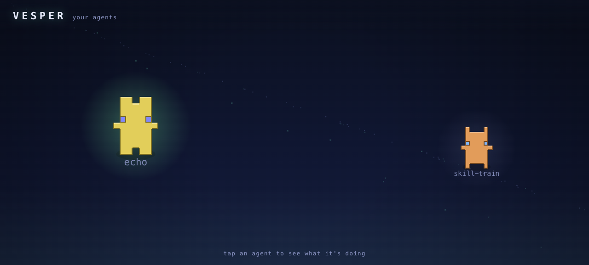
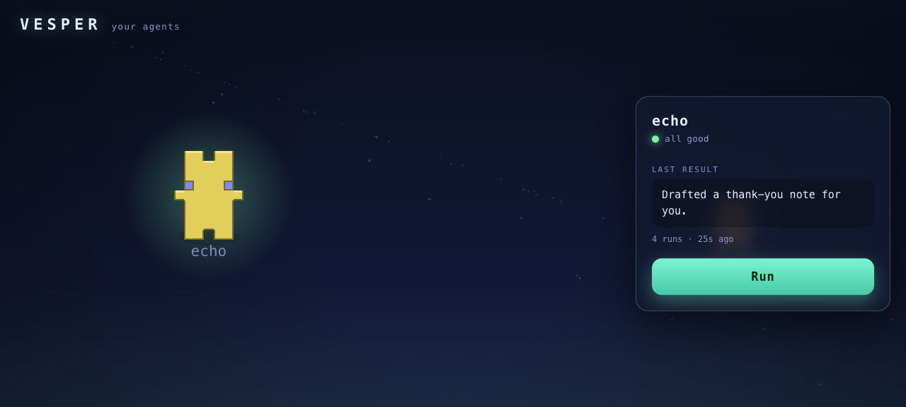

<p align="center">
  
</p>

<h1 align="center">Vesper</h1>

<p align="center">
  <a href="https://github.com/ogarciarevett/vesper/actions/workflows/ci.yml"></a>
  
  
  
  
</p>

<p align="center"><b>A local-first runtime for your personal automation agents — that you can actually watch work.</b></p>

Vesper runs on your machine and hosts small automation **pipelines** (your "agents") under one host
process. It drives **the AI CLI you already pay for** — `claude`, `codex`, `opencode`, or `gemini` —
so it holds **no API keys** and ships **no provider SDKs**. Nothing leaves your machine except the
calls your own CLI makes. And instead of a cold dashboard, you watch your agents in a little
pixel-art world: tap one to see, in plain language, what it just did — or to put it to work.

<table>
<tr><td width="34%"><b>Bring your own CLI — no keys</b></td><td>Orchestrates <code>claude</code> / <code>codex</code> / <code>opencode</code> / <code>gemini</code> over a subprocess. You pay once for your CLI; Vesper adds no per-call billing and stores no LLM credentials. Pick the model per request.</td></tr>
<tr><td><b>Watch your agents work</b></td><td>A pixel-art world (<i>Vesper World</i>) where each agent is a character — busier ones grow, the world livens up with use. Click one for a plain-language result + a big <b>Run</b> button. Built for someone who has never opened a terminal.</td></tr>
<tr><td><b>Local-first &amp; private</b></td><td>SQLite storage + OS-keychain secrets, all on your machine. The UI binds to <code>127.0.0.1</code> only. No accounts, no cloud, no telemetry.</td></tr>
<tr><td><b>Capability-sandboxed pipelines</b></td><td>Every agent declares what it may touch — invoke a CLI, read/write storage, touch files — and the host enforces it (deny-by-default) before any side effect.</td></tr>
<tr><td><b>Self-improving skills</b></td><td>The <code>skill-train</code> engine optimizes a skill's playbook against its own test set (SkillOpt-style: epochs, held-out validation, greedy accept) — using your CLI, never a provider key.</td></tr>
<tr><td><b>A real scheduler</b></td><td>Cron, event, and manual triggers with run-count caps, backoff, and a dead-letter queue. Your agents can run on their own, unattended.</td></tr>
</table>

<p align="center">
  
</p>

---

## Vesper World

```sh
vesper daemon start   # hosts the runtime + the UI (background)
vesper ui             # opens a browser tab — http://127.0.0.1:4317
```

<p align="center">
  
</p>

Tap an agent → a plain-language card shows what it last did and lets you run it. The world is a live
projection of your real runtime (pipelines, runs, schedules) — nothing is faked. It's deliberately
simple, and built to extend: a planned **Voice** module will let an agent *speak* its result aloud.
See [docs/ui.md](docs/ui.md).

## Bring your own CLI

Vesper does **not** ship or call any LLM provider SDK, and it never holds an API key. It orchestrates
the AI CLI you already have authenticated:

- [`claude`](https://docs.claude.com/en/docs/claude-code) (Claude Code) · `opencode` · `codex` · `gemini`

It shells out to whichever you have installed (via `Bun.spawn`) and composes on top. The only secrets
Vesper keeps are *pipeline-side* (e.g. a GitHub token) in your OS keychain — never LLM auth.

## Requirements

- [Bun](https://bun.sh) ≥ 1.1
- macOS (the vault uses the system Keychain via the `security` CLI)
- At least one installed, authenticated CLI from the list above (`vesper cli install <name>` can set one up)

## Install

```sh
git clone https://github.com/ogarciarevett/vesper.git
cd vesper && bun install
cd packages/vesper-cli && bun link    # make `vesper` global (or run from the repo)
```

## Quick start

```sh
vesper init          # create ~/.vesper, initialize storage, detect installed CLIs
vesper cli list      # show each CLI + probe status (ok / not-authenticated / not-installed)
vesper hello         # ask your configured CLI to reply — proves orchestration works
vesper daemon start  # start the runtime + UI (background)
vesper ui            # open Vesper World in your browser
```

`vesper hello` is the proof the model works: a fixed prompt to your CLI, reply printed — no
Vesper-held key, captured over a subprocess pipe.

## Commands

Generated from the command registry by `bun run docs:cli` and kept in sync by a pre-commit hook, so
this list never drifts. Run `vesper <command> --help` for details; see also [docs/CLI.md](docs/CLI.md).

<!-- BEGIN COMMANDS (auto-generated by `bun run docs:cli`) -->

| Command | Description |
| --- | --- |
| `vesper init` | Create the ~/.vesper runtime, initialize storage, and detect installed CLIs. |
| `vesper hello` | Ask the configured CLI to reply — proves orchestration works (no Vesper API key). |
| `vesper vault set <key>   # value via stdin` | Store a secret for a pipeline (value read from stdin, never the command line). |
| `vesper vault get <key>` | Print a stored secret value. |
| `vesper vault list` | List stored secret keys (never their values). |
| `vesper cli list` | List supported CLIs with version, working status, and remediation hints. |
| `vesper cli select <name>` | Set the default CLI adapter (must be installed). |
| `vesper cli install <name>` | Install a supported LLM CLI (claude/codex/opencode/gemini/cursor). |
| `vesper status` | Show versions and the health of every subsystem. |
| `vesper daemon run` | Run the daemon in the foreground (IPC + scheduler + UI). Ctrl-C to stop. |
| `vesper daemon start` | Start the daemon in the background (detached). |
| `vesper daemon stop` | Stop the running daemon. |
| `vesper daemon restart` | Restart the daemon (stop, then start). |
| `vesper daemon status` | Show the daemon's lifecycle status (PID, uptime, socket). |
| `vesper daemon install` | Install the daemon as a macOS LaunchAgent (starts at login, stays alive). |
| `vesper daemon uninstall` | Remove the macOS LaunchAgent and stop the daemon. |
| `vesper ui [--no-open]` | Open Vesper World — a visual, living view of your agents (requires the daemon). |
| `vesper schedule list` | List all scheduled tasks in an aligned table. |
| `vesper schedule show <id>` | Print full details for a single task. |
| `vesper schedule run <id> [--cli <name>] [--param key=value] [--quiet]` | Manually run a task by id, invoking the resolved CLI and recording a run. |
| `vesper schedule enable <id>` | Enable a scheduled task by id. |
| `vesper schedule disable <id>` | Disable a scheduled task by id. |
| `vesper runs list [--pipeline <name>] [--status <status>] [--limit <n>]` | List recorded pipeline runs (oldest first). |
| `vesper skill train <name> [--cli <a>] [--optimizer-cli <a>] [--judge-cli <a>] [--epochs N] [--batchsize M] [--val-fraction F] [--dry-run] [--yes]` | Train a skill against its tasks.json via the skill-train pipeline. |
| `vesper skill list [--skills-dir <dir>]` | List trainable skills (those with a tasks.json validation harness). |
| `vesper skill diff <name> [--skills-dir <dir>]` | Diff the committed SKILL.md against the trained best candidate. |
| `vesper skill accept <name> [--skills-dir <dir>] [--yes]` | Adopt the trained best candidate into the committed SKILL.md (checkpointed; revertible). |
| `vesper skill revert <name> [--skills-dir <dir>]` | Restore the committed SKILL.md from the latest accept checkpoint. |

<!-- END COMMANDS -->

## Configuration

`~/.vesper/config.json`:

```json
{
  "cli": {
    "default": "claude",
    "adapters": { "claude": { "command": "claude", "args": ["-p"] } }
  },
  "storage": { "redactRunSummaries": false },
  "presence": {
    "pollMs": 3000,
    "matchers": [
      { "id": "mytool", "label": "My Tool", "kind": "cli", "pattern": "(?:^|/)mytool(?:\\s|$)" }
    ]
  }
}
```

`cli.default` selects which CLI pipelines use; per-adapter `command`/`args` override the headless
invocation if a tool changes its flags. `storage.redactRunSummaries` (opt-in) stores run summaries as
size-only metadata instead of raw CLI output.

`presence` tunes the live agent view in Vesper World (the running agents it "echoes"). Vesper ships an
allowlist for `claude`, `codex`, `opencode`, `gemini`, and `zeroclaw`; `presence.matchers` **adds**
your own without touching code. Each matcher is `{ id, label, kind: "cli" | "app", pattern, exclude? }`,
where `pattern`/`exclude` are regexes matched (case-insensitively) against a process's full command
line — match the tool's binary, not its install path, to avoid false positives. `presence.pollMs` sets
the re-scan interval (default 3000). Malformed matchers (bad `kind`, uncompilable regex) are ignored.

## How it works

A `vesper-core` host (vault · SQLite storage · CLI adapters · capabilities · scheduler · IPC) runs
your pipelines; `vesper-cli` is the developer surface; `vesper-ui` is the consumer surface. Every LLM
call is a shell-out to your CLI — there is no provider SDK anywhere in the dependency tree.

## Development

```sh
bun test          # run the suite
bun run lint      # Biome lint + format check
bun run docs:cli  # regenerate docs/CLI.md + this README's command table (enforced pre-commit)
```

The only dependency is `@biomejs/biome` (+ Bun's types) — no LLM provider SDKs.

## License

MIT.
